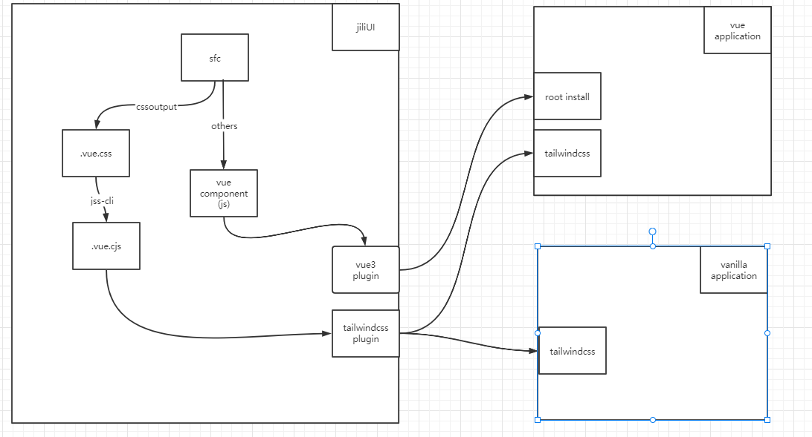

## 什么是JL UI

- 基于 vue3 + tailwind 开发的组件库。
- 提供原子类和组件类，在非vue的前端项目(默认使用了tailwindcss)下也能使用

## 效率 Efficiency

简化流程： 设计简洁直观的操作流程；

清晰明确： 语言表达清晰且表意明确，让用户快速理解进而作出决策；

帮助用户识别： 界面简单直白，让用户快速识别而非回忆，减少用户记忆负担。
